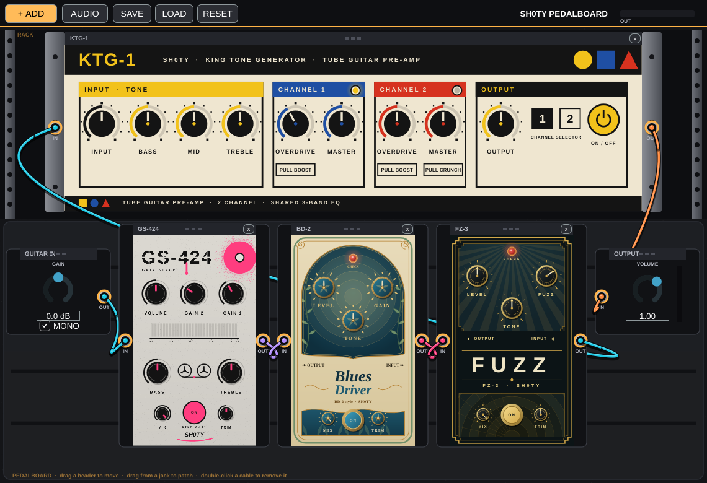
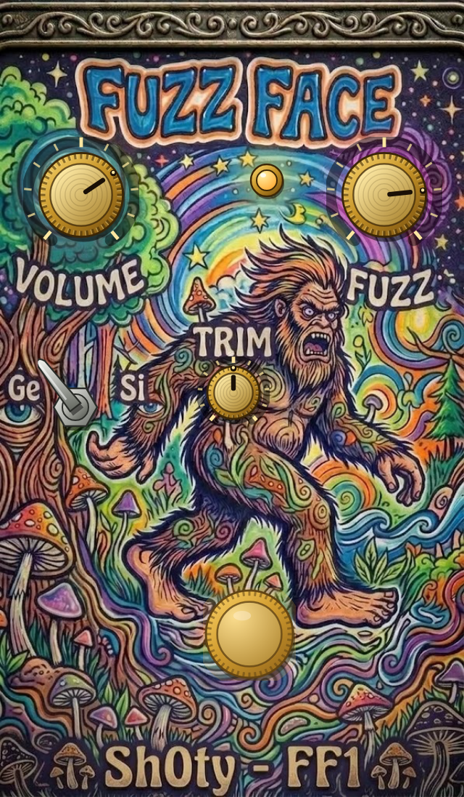
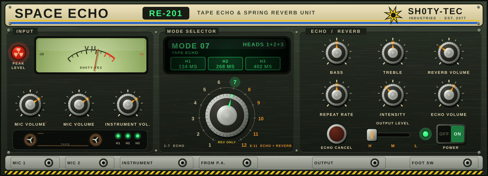

# Sh0ty VST plugins

Five guitar-pedal / preamp plugins (VST3, AU on macOS, and Standalone), built with JUCE:

| Plugin | Inspired by | Interface |
|---|---|---|
| **Sh0ty KTG-1** | Seymour Duncan KTG-1 two-channel tube preamp | Bauhaus |
| **Sh0ty FZ-3 Fuzz** | Boss FZ-3 | Art deco |
| **Sh0ty BD-2 Blues Driver** | Boss BD-2 | Art nouveau |
| **Sh0ty GS-424 Gain Stage** | Tascam Portastudio 424 MKIII input stage + Baxandall EQ | Minimal street art |
| **Sh0ty FF-1 Fuzz** | Classic two-transistor PNP germanium fuzz (with a germanium / silicon switch) | Psychedelic Sasquatch poster art |
| **Sh0ty RE-201 Space Echo** | Roland RE-201 Space Echo (tape echo + spring reverb), rack unit | Retro-futuristic wasteland vault |

These are "inspired by" models, not component-level circuit simulations. Interfaces are original artwork.

## Sh0ty Pedalboard (standalone app)

A standalone app that hosts all six plugins at once, with the KTG-1 and RE-201 as rack units on top and the pedals on a board
below. **Drag** a unit by its header to move it (rack units slide up and down). **Drag from a jack** to another jack to
patch a virtual cable (a stereo pair; a cable that would make a loop is refused). **Double-click** a cable, or right-click
and choose Delete, to remove it. Cables run under the pedals and over the rack units, with the plug heads and the stub at
each jack kept on top so they still read as plugged in. Use **+ ADD** to add more units (several of each are fine). **Guitar In** has a source
dropdown, a gain knob, a MONO switch (copies input 1 to both channels, which is what a guitar on a single input needs) and a
MUTED / LIVE switch. To avoid feedback, the app **starts with no input device open and Guitar In muted**: pick a source,
then switch it to LIVE (use headphones if the source is a microphone); **Output** has a
master volume and a level meter. Save and Load write `.sh0tyboard` files, and the app reopens your last board and audio
device. It is built as part of the normal build (`-DKTG1_BUILD_PEDALBOARD=OFF` to skip it); on macOS it is a universal
(Apple Silicon + Intel) app, unsigned like the plugins. Run it from `build/Sh0tyPedalboard_artefacts/Release/`.

## KTG-1 tube preamp

Two-channel tube guitar preamp with the control layout of the real rack unit: Input trim, shared
Bass / Mid / Treble, Channel 1 (Overdrive with pull boost, Master), Channel 2 (Overdrive with pull boost,
Master with pull crunch), Output, channel selector and On/Off. There is no schematic behind it, so the sound
is an "inspired by" model of generic triode-stage behaviour. Pull boost is modelled as a cathode-bypass
shelf (unity below the cap corner, extra gain above it), with a pre-distortion high-pass to keep the low end tight;
the tone stack is three decoupled EQ bands (a passive interactive stack is not modelled). Voicings and the signal
order are estimates. Bauhaus interface with original artwork.

## FZ-3 Fuzz

The FZ-3 DSP follows the signal path of the "Boss FZ3" schematic (JFET buffers, Q1 treble shelf,
Q3 fuzz stage, Q4, tone network, volume). The Fuzz pot's gain law is an estimate because the
schematic draws it as a placeholder; the sheet's clean "2 CH MIXER" branch is not modelled (use Mix).

## FF-1 Fuzz

A two-transistor PNP fuzz solved as a **real circuit**, from the "Fuzz Face PNP Ge" schematic: Q1 (emitter at ground,
33k collector load) drives Q2's base directly, Q2's emitter runs through the 1k FUZZ pot (20u on the wiper) to ground,
and a 100k resistor feeds Q2's emitter back to Q1's base. The 470R supply resistor and the 0.01u output cap feed the
500k VOLUME pot. Each sample solves the two Ebers-Moll transistors, the resistors and the capacitors together
(Newton-Raphson with trapezoidal capacitors; the two linear nodes are eliminated analytically). **Germanium vs
silicon** is a real switch between two transistor parameter sets (saturation current, leakage, gain; the silicon set
also uses a bias trimmer value); germanium biases to the textbook -0.65 V / -4.9 V at Q1 / Q2's collectors. Controls:
**Volume**, **Fuzz**, **Ge / Si**, footswitch and a small input **Trim** (it is a level-sensitive circuit, so trim
matters). Simplifications: ideal battery (no sag), the guitar is a plain 6k8 source resistor (no pickup inductance),
a gentle roll-off stands in for transistor bandwidth, no temperature drift. It runs at 2x oversampling because the
solve is the expensive part. The artwork is a supplied psychedelic Sasquatch poster (`Assets/fuzzface.jpg`) with the hardware placed on the lettering
painted into it: knurled brass dials for VOLUME and FUZZ over the two swirl orbs, a small brass TRIM on his chest, a nickel
toggle lever between the Ge and Si labels (thrown left for germanium, right for silicon), a domed brass stomp button between
his feet and a brass-bezel jewel as the status light. The artwork is the user's own supplied image; its rights are theirs
to sort out before the plugin is shared.

## RE-201 Space Echo

A rack-mount tape echo and spring reverb, built from the RE-201 block diagram and circuit sheets (mic amp -> recording
pre-amp -> record head -> tape loop with three playback heads -> playback pre-amp -> echo volume; INTENSITY feeds the
playback back to the recording pre-amp; a spring reverb is fed from the same send; BASS / TREBLE on the return; the dry
signal goes straight to the output pad). Interface: a weathered, riveted olive-steel panel with a phosphor-green CRT read-out,
analogue VU, radiation-trefoil PEAK lamp, chrome and Bakelite dials and a hazard-striped jack strip.

- **Tape**: heads sit at 1x / 2x / 3x the head-1 delay; **REPEAT RATE** is the tape speed (head 1 from about 300 ms down to
  60 ms), and the motor slews, so turning it bends the pitch like the real thing. Wow and flutter, a head/tape bandwidth
  roll-off that dulls every repeat, and a soft-saturating record path so INTENSITY can run away into self-oscillation
  without blowing up.
- **MODE SELECTOR** (12 positions): 1-3 single heads (1 shortest), 4 heads 1+2, 5-11 spring reverb with head 1 / 2 / 3 / 1+2 / 2+3 / 1+3 / all three, 12 spring only.
  The table follows published descriptions of the unit rather than a measurement of one; it is `modeInfo()` in `Source/SpaceEchoStage.h`.
- **Spring reverb**: two springs, each a delay with a chain of dispersive allpasses (the chirpy "boing"), damping and feedback.
- **Controls**: MIC VOLUME 1 / 2 (how much of the left / right input is sent to the echo), INSTRUMENT VOLUME (overall
  send, and drive into the pre-amp), BASS, TREBLE, REVERB VOLUME, REPEAT RATE, INTENSITY, ECHO VOLUME, OUTPUT LEVEL H/M/L,
  ECHO CANCEL (the foot switch) and POWER. Dry stereo passes through untouched; the echo/reverb return is mono, as on the real unit.
- Not modelled: the real transport's tape-wear, the bias oscillator and the motor circuit (the motor-replacement sheet was
  used only to confirm that speed is what sets the delay).

## BD-2 Blues Driver

Sh0ty BD-2 Blues Driver (Gain, Tone, Level, Mix, Input Trim) follows the Boss BD-2 schematic's signal path:
JFET input buffer, two PNP gain stages with the dual-gang Gain pot, 1SS133 diode clippers between them,
and an op-amp tone stage. Transistor stages are gain + asymmetric rail clipping, diodes are a soft-knee
limiter, the tone stage is a +/-10 dB tilt at 1 kHz, and the Gain pot's split across the two stages is an
estimate. FET bypass switching is not modelled. Art-nouveau interface with original artwork.

## GS-424 Gain Stage

Modelled from the Tascam 424 MKIII channel input stage (service-manual MIX PCB 2/4). **Gain 1** is the 424's
trim: the R22 10k rheostat in the Q201/Q202 (2SC732) differential pair, solved sample by sample
(`Vd = Vt ln((I+i)/(I-i)) + i*Rlink`), giving the schematic's ~4 dB to ~51 dB. **Gain 2** makes the U101B
difference amplifier's R211/R212 (8.2k stock) variable up to 82k; that is a pedal addition, not in the 424.
**Bass** and **Treble** are the 424's Baxandall HIGH / LOW EQ (U202B), computed from its netlist by
`tools/gen_baxandall.py` into `Source/PortaEq.h`. Volume follows the EQ; the mid band and the mic-input loading are
not modelled. The LED bar meter and the two stencilled reels follow the output level. Minimal street-art interface (concrete wall, one spray-painted circle, stencil lettering), original artwork.

## Pedal consistency
The four pedals (FZ-3, BD-2, GS-424, FF-1) share one spec so they sit together neatly on the pedalboard: 320 x 548 canvas,
80 px main knobs, 50 px small knobs (Mix / Trim), a 64 px stomp button and a 22 px status light, each in its own style.

## Build
    cmake -S . -B build -DCMAKE_BUILD_TYPE=Release
    cmake --build build -j
    ctest --test-dir build      # DSP tests

Each plugin's VST3 lands in `build/<Plugin>_artefacts/Release/VST3/` (for example `build/Sh0tyFZ3_artefacts/Release/VST3/`);
the pedalboard app is at `build/Sh0tyPedalboard_artefacts/Release/`. Copy the VST3s to your DAW's VST3 folder
(Windows: `C:\Program Files\Common Files\VST3`, macOS: `~/Library/Audio/Plug-Ins/VST3`,
Linux: `~/.vst3`). GitHub Actions builds Windows/macOS/Linux artifacts on every push.

Linux build deps: libasound2-dev libfreetype-dev libfontconfig1-dev libx11-dev libxinerama-dev
libxrandr-dev libxcursor-dev libxext-dev libgl1-mesa-dev

### macOS (Audio Unit + VST3)
CMake builds **AU** and **VST3** (and Standalone) on macOS, as universal binaries (Apple Silicon + Intel, macOS 10.13+).
GitHub Actions builds them and uploads `Sh0ty-plugins-macOS-universal` (zipped bundles) on every push; it also runs
Apple's `auval` on each AU (informational).

    cmake -S . -B build -DCMAKE_BUILD_TYPE=Release
    cmake --build build -j
    # install
    cp -R build/*_artefacts/Release/AU/*.component  ~/Library/Audio/Plug-Ins/Components/
    cp -R build/*_artefacts/Release/VST3/*.vst3     ~/Library/Audio/Plug-Ins/VST3/
    killall -9 AudioComponentRegistrar 2>/dev/null   # make the system rescan Audio Units

The plugins are **not notarized or signed with a developer ID**. If a downloaded copy is blocked by Gatekeeper, run
`xattr -dr com.apple.quarantine <plugin>` on it, or right-click it and choose Open. Validate an AU with
`auval -v aufx Ktg1 Sh0t` (KTG-1), `Fz3x` (FZ-3), `Bd2x` (BD-2) or `Gs42` (GS-424). Logic Pro only lists AUs that pass `auval`.

### CachyOS / Arch Linux
    sudo pacman -S --needed base-devel cmake git alsa-lib freetype2 fontconfig \
      libx11 libxinerama libxrandr libxcursor libxext mesa curl
    git clone https://github.com/sh0tybumbati/sh0ty-vst.git && cd sh0ty-vst
    git checkout ccr-0f36f608-4k30zx
    cmake -S . -B build -DCMAKE_BUILD_TYPE=Release
    cmake --build build -j
    ctest --test-dir build --output-on-failure
    mkdir -p ~/.vst3 && cp -r build/*_artefacts/Release/VST3/*.vst3 ~/.vst3/

Standalone apps (no DAW needed) are in `build/*_artefacts/Release/Standalone/`.
