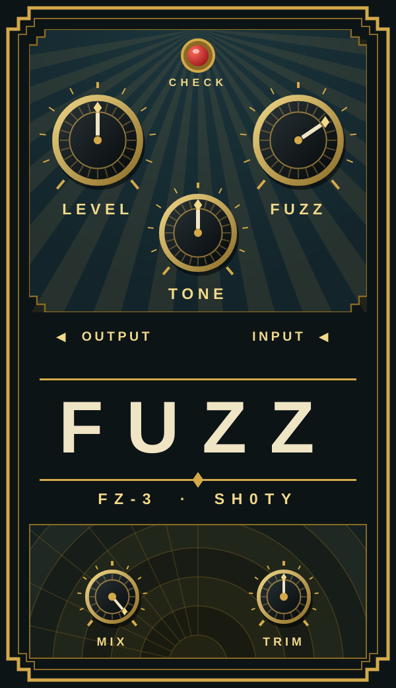
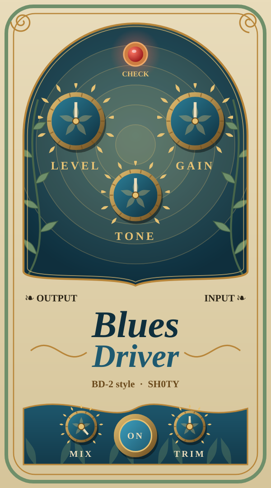
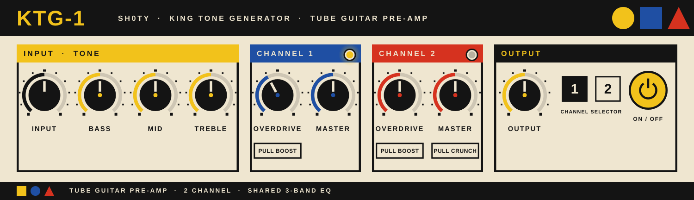
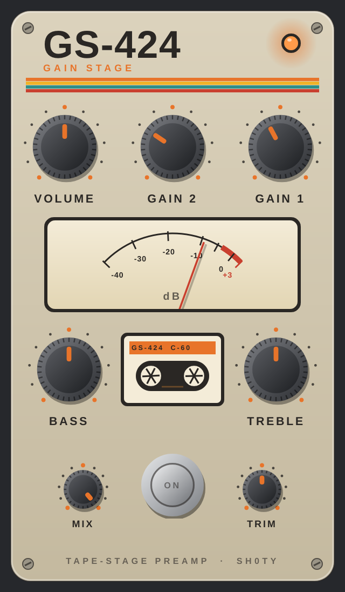

# Sh0ty VST plugins

Four guitar-pedal / preamp plugins (VST3, AU on macOS, and Standalone), built with JUCE:

| Plugin | Inspired by | Interface |
|---|---|---|
| **Sh0ty KTG-1** | Seymour Duncan KTG-1 two-channel tube preamp | Bauhaus |
| **Sh0ty FZ-3 Fuzz** | Boss FZ-3 | Art deco |
| **Sh0ty BD-2 Blues Driver** | Boss BD-2 | Art nouveau |
| **Sh0ty GS-424 Gain Stage** | Tascam Portastudio 424 MKIII input stage + Baxandall EQ | Retro cassette |

These are "inspired by" models, not component-level circuit simulations. Interfaces are original artwork.

## Build
    cmake -S . -B build -DCMAKE_BUILD_TYPE=Release
    cmake --build build -j
    ctest --test-dir build      # DSP tests

The VST3 lands in `build/Sh0tyKTG1_artefacts/Release/VST3/`. Copy it to your DAW's VST3 folder
(Windows: `C:\Program Files\Common Files\VST3`, macOS: `~/Library/Audio/Plug-Ins/VST3`,
Linux: `~/.vst3`). GitHub Actions builds Windows/macOS/Linux artifacts on every push.

Linux build deps: libasound2-dev libfreetype-dev libfontconfig1-dev libx11-dev libxinerama-dev
libxrandr-dev libxcursor-dev libxext-dev libgl1-mesa-dev

### macOS (Audio Unit + VST3)
CMake builds **AU** and **VST3** (and Standalone) on macOS, as universal binaries (Apple Silicon + Intel, macOS 10.13+).
GitHub Actions builds them and uploads `Sh0ty-plugins-macOS-universal` (zipped bundles) on every push; it also runs
Apple's `auval` on each AU (informational).

    cmake -S . -B build -DCMAKE_BUILD_TYPE=Release
    cmake --build build -j
    # install
    cp -R build/*_artefacts/Release/AU/*.component  ~/Library/Audio/Plug-Ins/Components/
    cp -R build/*_artefacts/Release/VST3/*.vst3     ~/Library/Audio/Plug-Ins/VST3/
    killall -9 AudioComponentRegistrar 2>/dev/null   # make the system rescan Audio Units

The plugins are **not notarized or signed with a developer ID**. If a downloaded copy is blocked by Gatekeeper, run
`xattr -dr com.apple.quarantine <plugin>` on it, or right-click it and choose Open. Validate an AU with
`auval -v aufx Ktg1 Sh0t` (KTG-1), `Fz3x` (FZ-3), `Bd2x` (BD-2) or `Gs42` (GS-424). Logic Pro only lists AUs that pass `auval`.

### CachyOS / Arch Linux
    sudo pacman -S --needed base-devel cmake git alsa-lib freetype2 fontconfig \
      libx11 libxinerama libxrandr libxcursor libxext mesa curl
    git clone https://github.com/sh0tybumbati/sh0ty-vst.git && cd sh0ty-vst
    git checkout ccr-0f36f608-4k30zx
    cmake -S . -B build -DCMAKE_BUILD_TYPE=Release
    cmake --build build -j
    ctest --test-dir build --output-on-failure
    mkdir -p ~/.vst3 && cp -r build/*_artefacts/Release/VST3/*.vst3 ~/.vst3/

Standalone apps (no DAW needed) are in `build/*_artefacts/Release/Standalone/`.

## BD-2 Blues Driver

Sh0ty BD-2 Blues Driver (Gain, Tone, Level, Mix, Input Trim) follows the Boss BD-2 schematic's signal path:
JFET input buffer, two PNP gain stages with the dual-gang Gain pot, 1SS133 diode clippers between them,
and an op-amp tone stage. Transistor stages are gain + asymmetric rail clipping, diodes are a soft-knee
limiter, the tone stage is a +/-10 dB tilt at 1 kHz, and the Gain pot's split across the two stages is an
estimate. FET bypass switching is not modelled. Art-nouveau interface with original artwork.

## KTG-1 tube preamp

Two-channel tube guitar preamp with the control layout of the real rack unit: Input trim, shared
Bass / Mid / Treble, Channel 1 (Overdrive with pull boost, Master), Channel 2 (Overdrive with pull boost,
Master with pull crunch), Output, channel selector and On/Off. There is no schematic behind it, so the sound
is an "inspired by" model of generic triode-stage behaviour. Pull boost is modelled as a cathode-bypass
shelf (unity below the cap corner, extra gain above it), with a pre-distortion high-pass to keep the low end tight;
the tone stack is three decoupled EQ bands (a passive interactive stack is not modelled). Voicings and the signal
order are estimates. Bauhaus interface with original artwork.

## GS-424 Gain Stage

Modelled from the Tascam 424 MKIII channel input stage (service-manual MIX PCB 2/4). **Gain 1** is the 424's
trim: the R22 10k rheostat in the Q201/Q202 (2SC732) differential pair, solved sample by sample
(`Vd = Vt ln((I+i)/(I-i)) + i*Rlink`), giving the schematic's ~4 dB to ~51 dB. **Gain 2** makes the U101B
difference amplifier's R211/R212 (8.2k stock) variable up to 82k; that is a pedal addition, not in the 424.
**Bass** and **Treble** are the 424's Baxandall HIGH / LOW EQ (U202B), computed from its netlist by
`tools/gen_baxandall.py` into `Source/PortaEq.h`. Volume follows the EQ; the mid band and the mic-input loading are
not modelled. The VU meter and cassette reels follow the output level. Original artwork.

## FZ-3 model
The FZ-3 DSP follows the signal path of the "Boss FZ3" schematic (JFET buffers, Q1 treble shelf,
Q3 fuzz stage, Q4, tone network, volume). The Fuzz pot's gain law is an estimate because the
schematic draws it as a placeholder; the sheet's clean "2 CH MIXER" branch is not modelled (use Mix).
